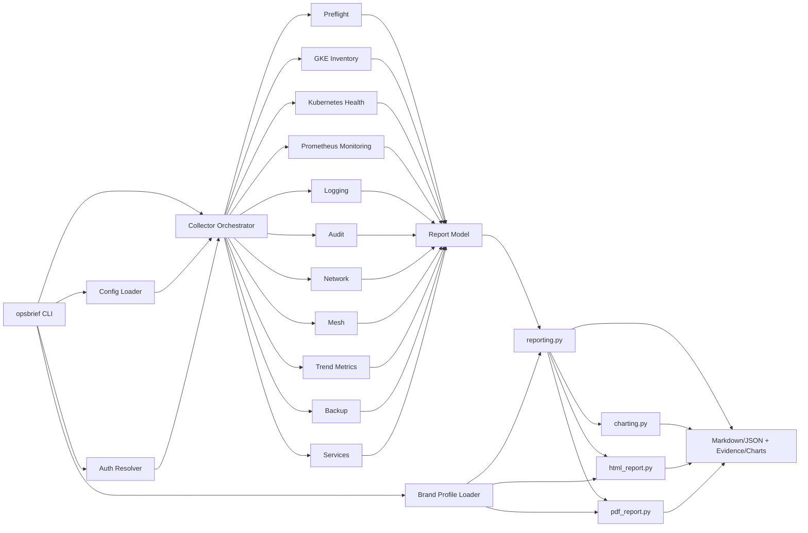
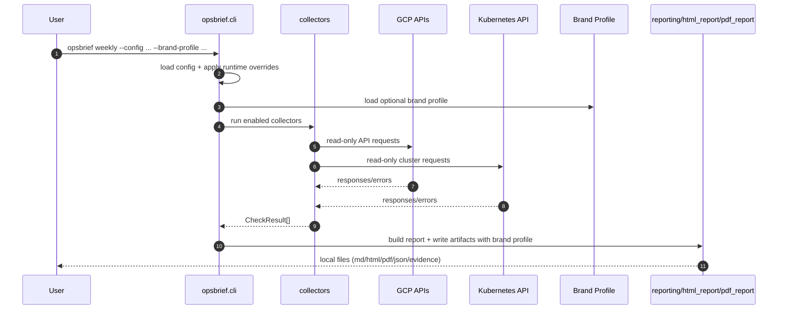
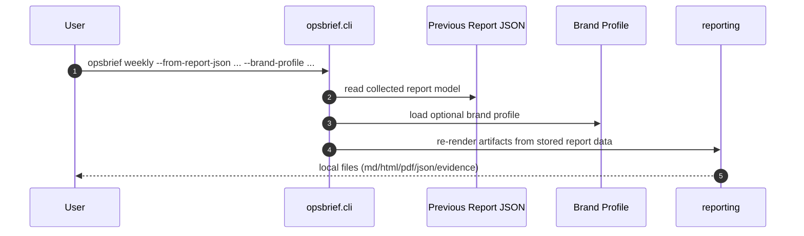

# Architecture

## High-Level Components

## Weekly Command Execution

## Replay Command Execution

Replay mode does not invoke the auth resolver, collectors, GCP APIs, or Kubernetes API.
It is intended for iterating on report layout/branding from already collected data.

## Design Notes

- Current provider support is GCP-first.
- Generic usage is achieved through runtime scoping (project/region/cluster args) and config-driven behavior.
- `reporting.py` assembles deterministic Markdown sections and writes artifacts.
- `charting.py` renders deterministic PNG charts from stored time-series evidence.
- `html_report.py` converts generated Markdown to branded HTML and owns print layout rules.
- `pdf_report.py` renders the branded HTML document to PDF with WeasyPrint.
- Client-specific styling is achieved through brand profile YAML, not collector logic.
- No organization-specific decision logic is required for core collectors.
