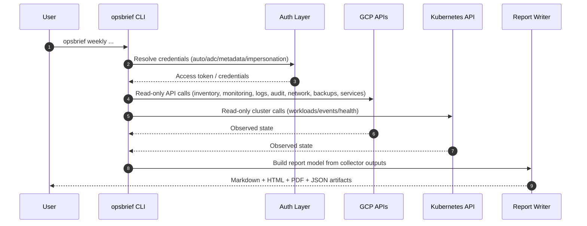

# User Guide

This guide is for operators and report consumers who run `opsbrief` and share outputs.

## Prerequisites

- Python 3.11+
- Hatch
- `gcloud` CLI installed and authenticated
- Network access to required Google APIs and (if needed) private GKE API endpoints

## Authenticate to GCP

`opsbrief` defaults to `--auth-mode auto`: it tries Application Default Credentials first and falls back to the active `gcloud` user token. Sign in before running any command:

```bash
gcloud auth login
gcloud auth application-default login
```

Without a valid `gcloud` session, the CLI fails at the auth resolution step. If you run with `--auth-mode adc`, only ADC is used (no `gcloud` fallback); for service-account workflows, use `--auth-mode impersonation --impersonate-service-account <sa>`.

## Typical Workflow

1. Authenticate via `gcloud auth login` (see above).
2. Run preflight to verify credentials/access.
3. Run weekly report command.
4. Share generated Markdown/HTML/PDF artifacts.

Use `--config` for runtime scope and collector settings. Use `--brand-profile` for
organization-specific report styling. These are separate files so the same collected data can
be re-rendered with a different client brand without calling GCP again.
Use `config/examples/auto-discovery.yaml` or `config/examples/explicit-clusters.yaml`
as sanitized starting points when you want a committed config file instead of
runtime-only CLI overrides.

```bash
hatch run opsbrief preflight \
  --config config/runtime.yaml \
  --env dev \
  --project example-dev-project \
  --region us-central1

hatch run opsbrief weekly \
  --config config/runtime.yaml \
  --env dev \
  --project example-dev-project \
  --region us-central1 \
  --brand-profile config/brand.example.yaml \
  --output-dir ./reports
```

To re-render Markdown/HTML/PDF artifacts from data that was already collected, use the
previous weekly report JSON:

```bash
hatch run opsbrief weekly \
  --from-report-json ./reports/dev/weekly/2026-W20/opsbrief-dev-weekly-report.json \
  --brand-profile config/brand.example.yaml \
  --output-dir ./reports
```

This replay path does not run collectors or make GCP/Kubernetes API calls. It preserves
the environment, generated timestamp, ISO week, and collector data stored in the source
JSON. Pass `--manual-input <file>` with replay mode when you want to replace the manual
sections while keeping the same collected evidence. `--config` is optional in replay
mode; pass it only when you want config-backed report options such as
`reporting.include_evidence_index` or `reporting.include_collector_warnings_and_gaps`.

The rendered Evidence Index section is disabled by default. Enable it per run with
`--include-evidence-index`, or set `reporting.include_evidence_index: true` in the
runtime config. Evidence JSON files are still written either way.

The rendered `Collector Warnings And Gaps` section is also disabled by default. Set
`reporting.include_collector_warnings_and_gaps: true` to include it.

## Brand Profile

`config/brand.example.yaml` is a complete, provider-neutral sample profile. It includes an
original OpsBrief SVG mark and an application-style palette, without using a Google Cloud,
Google, or Material UI logo. Copy it before replacing values for your organization. The tool does
not infer brand rules from PDF files; keep the PDF as source material and encode report-specific
values explicitly. The abbreviated example below shows the fields you would change after copying
the bundled profile:

```yaml
organization_name: Example Organization
report_title: Example Organization Weekly Operational Report
logo_path: brand-assets/logo.png
logo_alt: Example Organization logo
logo_width_mm: 35
font_family: "Inter, -apple-system, BlinkMacSystemFont, 'Segoe UI', Arial, sans-serif"
font_faces:
  - family: Inter
    path: brand-assets/fonts/Inter-Regular.ttf
    weight: 400
    style: normal
colors:
  primary: "#0f172a"
  secondary: "#0b1324"
  accent: "#1e3a5f"
  background: "#f3f5f9"
  surface: "#ffffff"
  text: "#0f172a"
  muted: "#475569"
  border: "#dbe1ea"
  header_background: "#e8edf6"
  row_alternate: "#f8fafc"
  code_background: "#f1f5f9"
report_theme:
  theme_lines:
    enabled: false
    count: 0
    color: ""
  corner_motif:
    enabled: false
    fill: ""
    border: ""
  status_colors:
    ok: ""
    warning: ""
    critical: ""
    scoped: ""
  chart_palette: []
```

Use `config/brand.example.yaml` as the public starting point. Keep
organization-specific profiles, logo/font assets, and brand guidelines outside this
repository. `font_faces` is optional; use it when approved local font files must be
embedded into generated HTML/PDF output instead of relying on workstation-installed fonts.
`report_theme` is optional report presentation metadata for motif toggles, semantic status
colors, and chart series palette.

PDF output is rendered from the branded HTML layout with WeasyPrint. On macOS, install
WeasyPrint's native GLib/Pango dependency with `brew install pango` before generating
PDF artifacts.

## Data Flow



Replay mode starts from a previous `opsbrief-<env>-weekly-report.json` and skips the auth
resolver, GCP APIs, Kubernetes API, and collectors. It only rebuilds local artifacts.

## Output Artifacts

- `opsbrief-<env>-weekly-report.md`
- `opsbrief-<env>-weekly-report.html`
- `opsbrief-<env>-weekly-report.pdf`
- `opsbrief-<env>-weekly-report.json`
- `evidence/collector-status.json`
- `evidence/collectors/*.json`
- `evidence/charts/*.png` when collected evidence includes chartable time series

## Behavior Contract

- The tool is read-only.
- The tool reports current observed state.
- The tool does not perform remediation or write to cloud resources.

For configuration details, see [configuration.md](configuration.md).
